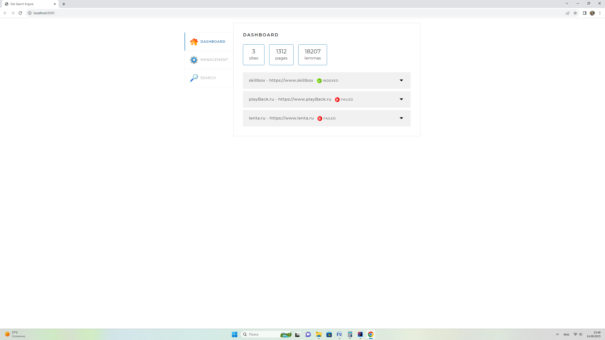
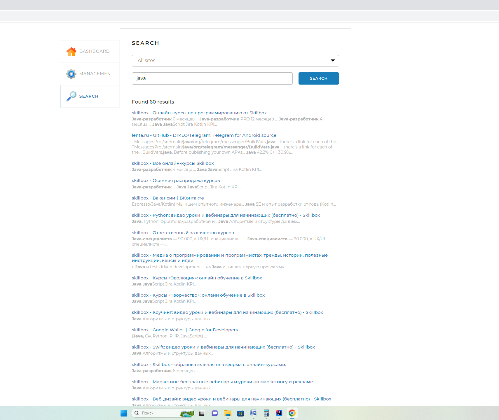

#  ✨ Поисковый движок 

## Описание:
- 🔍 Данное приложение позволяет индексировать страницы сайтов и осуществлять быстрый поиск нужной информации.
- 🌐 Работа приложения основана на обработке HTTP-запросов и ответов, а также использовании REST/JSON для обмена данными между клиентом и сервером.
- ⚙️ Приложение разработано на языке Java с использованием Spring Framework.

### После индексации страницы сайтов можно осуществлять быстрый поиск нужной информации:

## Функционал сервиса:
- 📜 Перед запуском приложения в конфигурационном файле задаются адреса сайтов, по которым будет осуществляться поиск.
- 🔄 Движок автоматически проходит по всем страницам указанных сайтов и индексирует их, чтобы затем находить наиболее релевантные результаты по любым поисковым запросам.
- ⏸️ Реализованы функции остановки индексации и индексации отдельных страниц, что позволяет пользователям управлять процессом.
- 🌐 Веб-интерфейс доступен по адресу: [http://localhost:8080](http://localhost:8080).
- 🎸 Нажатие кнопки "Start Indexing" запускает процесс обхода всех страниц заданных сайтов и их индексацию для последующего поиска по запросу "query".
- 💬 Пользователи могут отправлять запросы через API движка, получая результат поиска в удобном формате.
- 🔍 На основе этих запросов происходят поиск страниц, содержащих указанные слова, что позволяет находить точную информацию.
- 📬 Результаты поиска по запросу “query” отдаются пользователю в структурированном виде.

## Требования

### JDK 17
Проект использует синтаксис Java 17.

### Docker
Для запуска проекта необходимо установить и запустить Docker. Для работы с базой данных (Postgresql) нужно запустить соответствующий контейнер.

```bash
cd docker
```
```bash
cd docker
```
```bash
docker-compose up
```
- Необходимо указать Ваши параметры подключения ( username: ******  password:****** ) в **application.yaml**
## Используемые технологии:
-  SQL 
-  Java 
-  Spring 
-  Thymeleaf 
-  Postgresql 
-  JPA (Hibernate) 
-  Jsoup: Java HTML parser 
-  Fork/Join Framework in Java 
-  Spring-boot-starter-security  

### IntelliJ IDEA

- Для локального запуска проекта откройте файл Application.java и запустите его main-метод.


## Database:
- Postgresql


____
✉  Почта для обратной связи:
<a href="">krp77@mail.ru</a>

### Сертификат о прохождении курса


